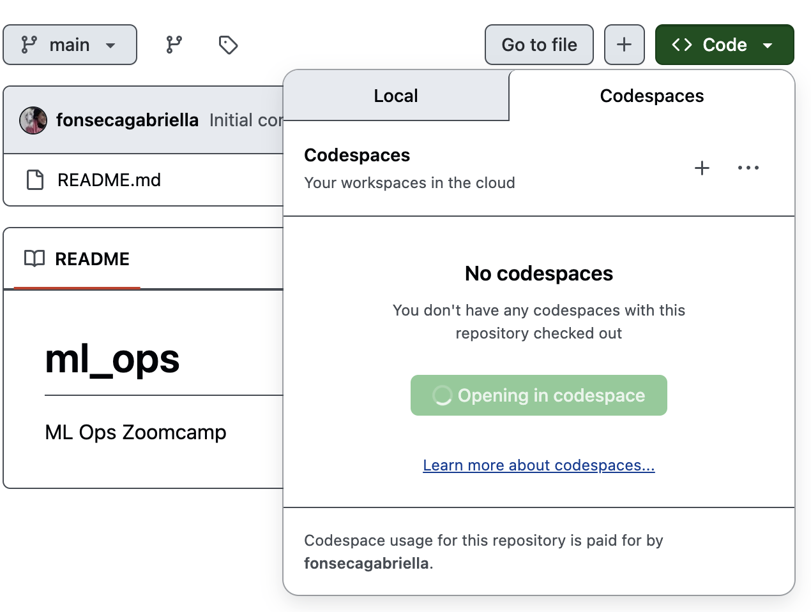
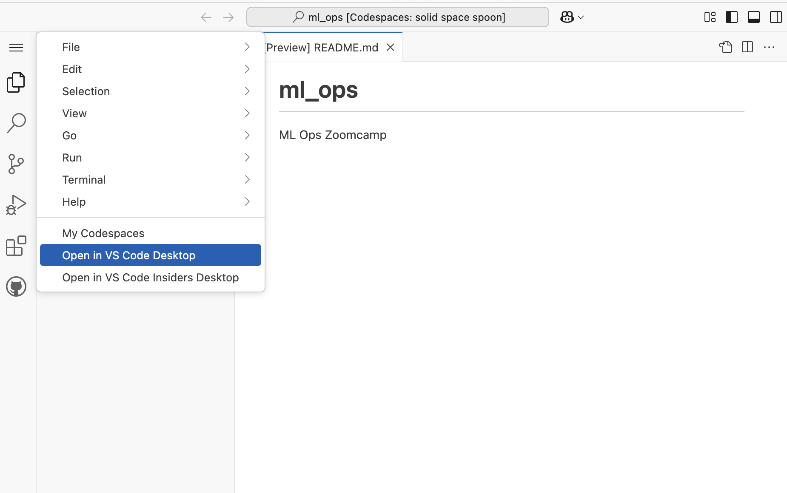
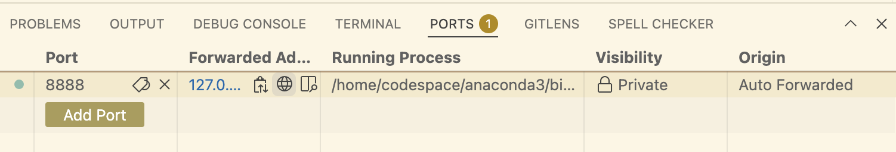

# ML Ops - Introduction

## The three steps of ML Ops

01. Design: Is machine learning necessary for our project?
If the answer is yes we go to the next step.

02. Train: We try to find the best possible model.

03. Operate: Once we have the model, we deploy it

## Preparing the environment: Github codespaces
1. Create a repository

2. Click on code >> codespaces
In your browser a new windos will open.


3. To work in your computer, click on the tree lines on the top >> open in VS desktop



4. Open the terminal and install Anaconda

```bash
wget https://repo.anaconda.com/archive/Anaconda3-2022.05-Linux-x86_64.sh
bash Anaconda3-2022.05-Linux-x86_64.sh
```

5. Open a new terminal window and run `jupyter notebook`

6. You will see that there's a new port open when you check "ports". From there you can click on the web link, to open the web interface.



7. You will need to add the token, which you can get via the terminal

