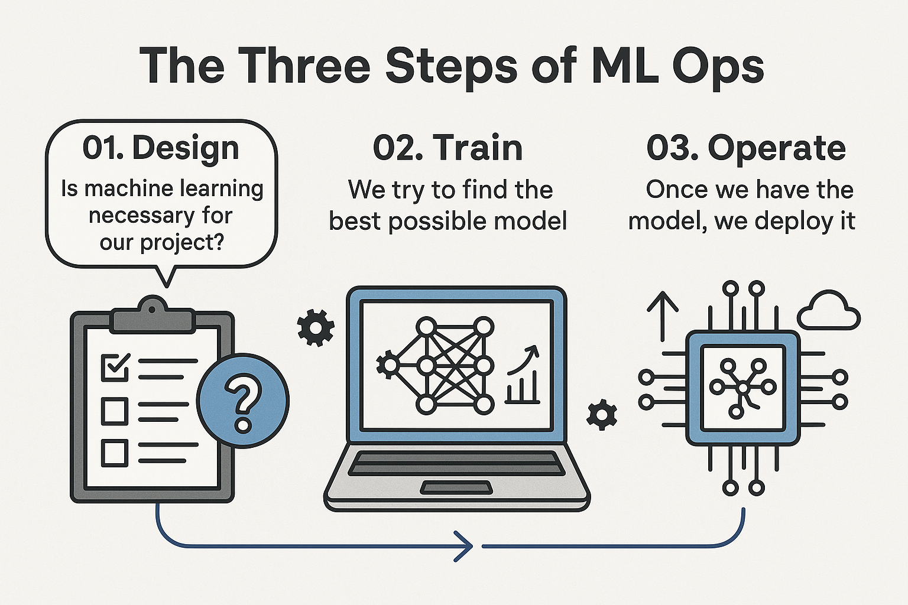

# ML Ops - Introduction


[Image source](https://ml-ops.org/content/mlops-principles)

## 📚 Index

1. [ML Ops - Introduction](#ml-ops---introduction)
2. [The Three Steps of ML Ops](#the-three-steps-of-ml-ops)
3. [ML Pipeline](#ml-pipeline)
4. [MLOps Model Overview](#mlops-model-overview)
5. [Preparing the Environment: Github Codespaces](#preparing-the-environment-github-codespaces)

---

## The three steps of ML Ops

01. Design: Is machine learning necessary for our project?
If the answer is yes we go to the next step.

02. Train: We try to find the best possible model.

03. Operate: Once we have the model, we deploy it



---

## ML Pipeline

01. Load & Prepare Data
02. Vectorize
03. Train


---

## MLOps Model Overview

The MLOps maturity model outlines five levels ranging from no automation to full automation, setting a clear framework for evaluating machine learning maturity.

- 👨‍💻 **Level 0 - No MLOps:** Initially, machine learning is done without automation, often through Jupyter notebooks, which fail to support trackable and robust project management.

- 🔧 **Level 1 - DevOps Fundamentals:** This level introduces automation by applying standard software engineering practices for deployment but lacks specific machine learning-oriented practices.

- ⚙️ **Level 2 - Automating Training:** At this stage, the training of models becomes more streamlined, incorporating experiment tracking and model management, enabling teams to collaborate more effectively.

- 📦 **Level 3 - Easier Deployment:** This level focuses on automating the deployment of models, allowing data scientists to deploy models similarly to web services and enabling performance tracking through A/B testing.

- 🔄 **Level 4 - Full Automation:** The pinnacle of the maturity model where both training and deployment are automated, allowing for dynamic retraining in response to performance drifts.


---

## Preparing the environment: Github codespaces
01. Create a repository

02. Click on code >> codespaces
In your browser a new windos will open.


03. To work in your computer, click on the tree lines on the top >> open in VS desktop


04. Open the terminal and install Anaconda

```bash
wget https://repo.anaconda.com/archive/Anaconda3-2022.05-Linux-x86_64.sh
bash Anaconda3-2022.05-Linux-x86_64.sh
```

05. Open a new terminal window and run `jupyter notebook`

06. You will see that there's a new port open when you check "ports". From there you can click on the web link, to open the web interface.


07. You will need to add the token, which you can get via the terminal

