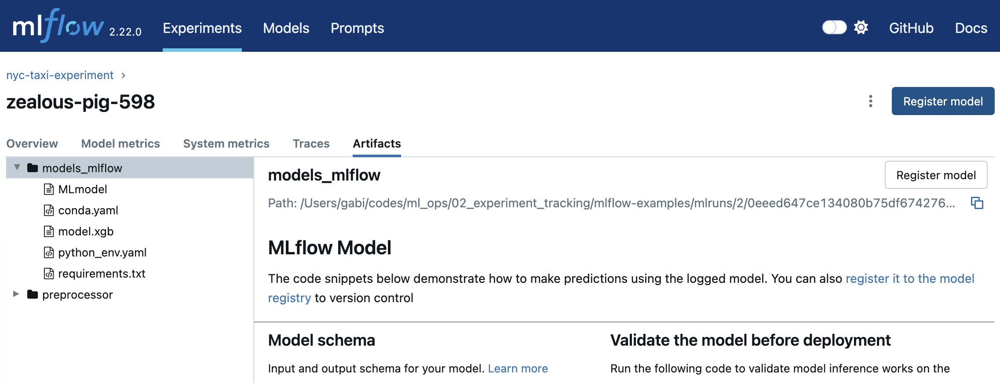

# MLOps - Experiment Tracking

## 📚 Index

1. [Step-by-Step Tutorial: Installing and Using MLflow for Local Experiment Tracking](#01-step-by-step-tutorial-installing-and-using-mlflow-for-local-experiment-tracking)  
   1.1 [Prepare Your Local Environment](#step-1-prepare-your-local-environment)  
   1.2 [Launch MLflow UI with a Backend Store](#step-2-launch-mlflow-ui-with-a-backend-store)  
   1.3 [Setup Your Jupyter Notebook](#step-3-setup-your-jupyter-notebook-for-mlflow-experiment-tracking)  
   1.4 [Run and Track Your Model Experiments](#step-4-run-and-track-your-model-experiments)  

2. [MLflow](#02-mlflow)  
   2.1 [Simple Commands](#021-simple-commands)  
   2.2 [Load Back a Model](#022-load-back-a-model)  
   2.3 [Selecting the Best Model](#023-selecting-the-best-model)  

3. [Hyperparameter Tuning with Hyperopt and Logging with MLflow](#03-hyperparameter-tuning-with-hyperopt-and-logging-with-mlflow)  
   3.1 [Key Concepts in Hyperopt](#031-key-concepts-in-hyperopt)  

4. [Model Selection & Registry](#04-model-selection--registry)  


-------

📝 [Other awesome notes](https://github.com/ziritrion/mlopszoomcamp/blob/main/notes/2_experiment.md)

------


## 01. Step-by-Step Tutorial: Installing and Using MLflow for Local Experiment Tracking

**Step 1: Prepare Your Local Environment**

**- Create a Python Virtual Environment (optional):**
It is recommended to avoid messing with your system Python or existing installations. Use conda or virtualenv to create an isolated environment.

- Example with conda:

`conda create --name experiment_tracking python=3.9`

After that, activate the environment:

`conda activate experiment_tracking`

**- Install Required Packages:**
Use a prepared [requirements file](./requirements.txt) to install all necessary dependencies including MLflow, Jupyter Notebook, pandas, scikit-learn, and others.
To download the file into your local Linux environment, navigate to your desired directory and run:

`wget https://raw.githubusercontent.com/DataTalksClub/mlops-zoomcamp/refs/heads/main/02-experiment-tracking/requirements.txt`

`pip install -r requirements.txt`

You can verify the installations with `pip list`.

**Step 2: Launch MLflow UI with a Backend Store**

**- Understanding the Backend Store:**
MLflow needs a backend store to save experiment metadata and artifacts. By default, it requires explicit configuration to avoid errors.
For simplicity, use a local SQLite database backend:

`mlflow ui --backend-store-uri sqlite:///mlflow.db`

This command starts the MLflow UI server and configures SQLite as the artifact/metadata database.

**- Access the UI:**
Open your browser and navigate to http://localhost:5000 to see the MLflow dashboard. Initially, it might show empty experiments if no runs exist yet.


**Step 3: Setup Your Jupyter Notebook for MLflow Experiment Tracking**

- Open the Relevant Jupyter Notebook:
There is a list of examples [here](./mlflow-examples/)
Make sure you select the Python kernel that corresponds to your created environment (e.g., Python 3.9).


- Set MLflow Tracking URI:
Because MLflow UI was started pointing to the SQLite database, set the tracking URI accordingly inside your notebook:

`mlflow.set_tracking_uri("sqlite:///mlflow.db")``

- Create or Set an Experiment:
Use MLflow’s set_experiment function to create or switch to an experiment. If it does not exist, MLflow creates it.

`mlflow.set_experiment("New York City Taxi Experiment")`

You should see a new experiment appear in the MLflow UI.

**Step 4: Run and Track Your Model Experiments**

- Load and Preprocess Data

- Train Models (e.g., Linear Regression and Lasso):
Train your models as usual in the notebook.

- Create a Folder for Saving Models
Create a models folder manually to avoid errors during model saving.

- Integrate MLflow Tracking for Each Run:
Wrap model training and evaluation inside an MLflow run context to log parameters, metrics, and tags.

```python
with mlflow.start_run():
    mlflow.log_param("alpha", 0.01) # Example hyperparameter
    mlflow.set_tag("developer", "Alexa") # Optional tag
    mlflow.log_param("train_data_path", "data/jan_2021.csv")
    mlflow.log_param("valid_data_path", "data/feb_2021.csv")

    # Train model here...
    model = Lasso(alpha=0.01)
    model.fit(X_train, y_train)
    rmse = evaluate_rmse(model, X_valid, y_valid)

    mlflow.log_metric("rmse", rmse) # Save the model artifact if desired

    mlflow.sklearn.log_model(model, "model")
```

- View Runs in MLflow UI:
After running, go to the MLflow UI and refresh the page. You will see new runs with logged parameters, metrics, tags, and artifacts.
You can inspect run details, compare runs, and track experiment history visually.


## 02. MLflow

### 02.1 Simple commands

- `mlflow.start_run()` returns the current active run, if one exists. The returned object is a Python context manager, which means that we can use the with statement to wrap our experiment code and the run will automatically close once the statement exits.
- `mlflow.set_tag()` creates a key-value tag in the current active run (for example, author name)
- `mlflow.log_param()` logs a single key-value param in the current active run.
- `mlflow.log_metrics()` logs a single key-value metric, which must always be a number. MLflow will remember the value history for each metric.

### 02.2 Load back a model

When we are using MLflow, we have this line: `mlflow.sklearn.log_model(model, artifact_path="model")`. In essence, we're telling MLFlow: "Save this model inside the run's artifact folder, in a subfolder named model".

To load back this model we need to:

1. Get the run id

```python
with mlflow.start_run() as run:
    run_id = run.info.run_id
```

2. Load the model

```python
import mlflow.sklearn

# Replace with your actual run ID
run_id = "abc123def456"

# Load the model from the "model" artifact path of the run
model = mlflow.sklearn.load_model(f"runs:/{run_id}/model")

# Now you can use it
y_pred = model.predict(X_val)

```

### 02.3 Selecting the best model

- From MLflow UI, filter runs by the desired metric, e.g., lowest RMSE.
- Inspect hyperparameters of best runs.
- Consider not only error but also model complexity, training time, and other practical metrics.
- Choose a model balancing accuracy and other constraints.


## 03. Hyperparameter Tuning with Hyperopt and Logging with MLflow
Hyperopt is a Python library used for automated hyperparameter tuning. It helps with:

- Defining a search space of possible parameter values
- Using a smart search algorithm (e.g. Bayesian optimization) to explore it
- Evaluating model performance for each trial
- Returning the best parameters found

### 03.1 Key concepts in Hyperopt

- **Search space**: Define which parameters to optimise and their ranges/types.

```python
space = {
    'C': hp.loguniform('C', -4, 2),  # C between exp(-4) and exp(2)
    'penalty': hp.choice('penalty', ['l1', 'l2'])
}
```

- **Objective function**: A function that takes parameters as input and returns a loss/error to minimise.

```python
def objective(params):
    model = LogisticRegression(**params)
    model.fit(X_train, y_train)
    acc = accuracy_score(y_val, model.predict(X_val))
    return {'loss': -acc, 'status': STATUS_OK}
```
- **Search algorithm**:
    - `tpe.suggest` (Tree-structured Parzen Estimator) – smart, Bayesian-like
    - `rand.suggest` – random search


- **Running the optimisation:**

Below Hyperopt will try up to 50 different combinations and return the best one it found. It's much smarter than grid search or manual tuning.

```python
from hyperopt import fmin, tpe, Trials

best = fmin(
    fn=objective,
    space=space,
    algo=tpe.suggest,
    max_evals=50,
    trials=Trials()
)
```

- **NOTE**: Example of implementation [here](./mlflow-examples/scenario-4.ipynb)

## 04. Model selection & registry
To decide on a model, you should also look:

- The loss metric
- The time it took to train (models that took longer to train, are usually more complex)
- The size of the model

When you access these three, you can better select the model that should go into production.

To register a model, you can select the model in MLFlow, and then register it there.



