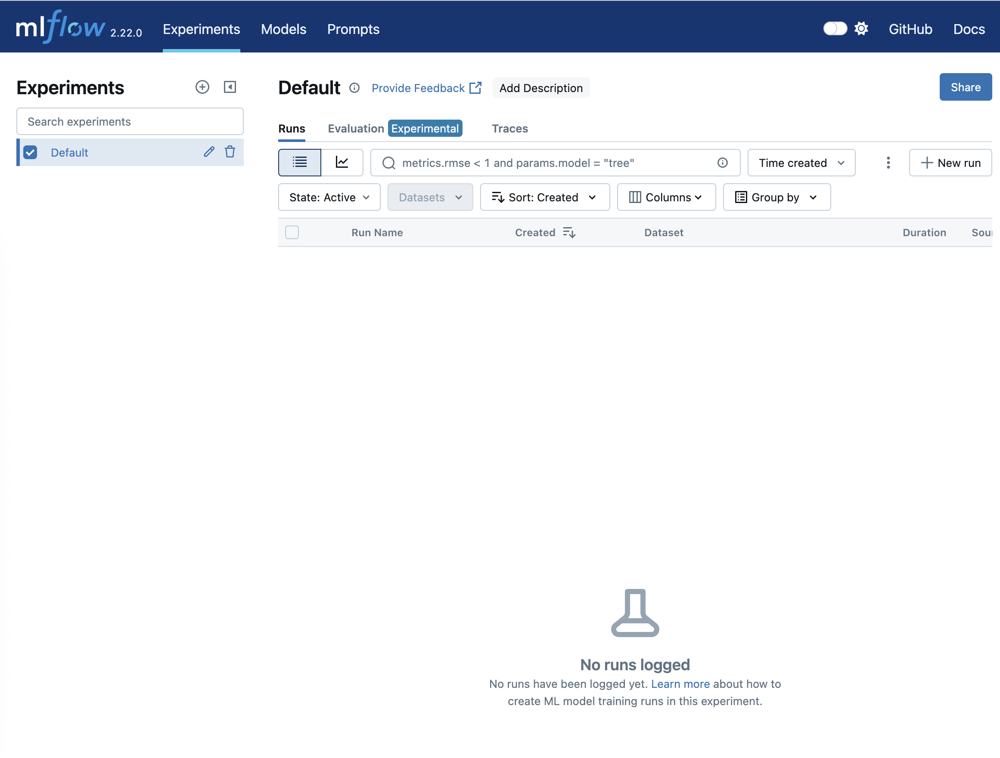

# MLOps - Experiment Tracking

Notes: https://github.com/ziritrion/mlopszoomcamp/blob/main/notes/2_experiment.md


## Step-by-Step Tutorial: Installing and Using MLflow for Local Experiment Tracking

### Step 1: Prepare Your Local Environment 

**- Create a Python Virtual Environment (optional):**
It is recommended to avoid messing with your system Python or existing installations. Use conda or virtualenv to create an isolated environment.

- Example with conda:

`conda create --name experiment_tracking python=3.9`

After that, activate the environment:

`conda activate experiment_tracking`

**- Install Required Packages:**
Use a prepared [requirements file](./requirements.txt) to install all necessary dependencies including MLflow, Jupyter Notebook, pandas, scikit-learn, and others.

`pip install -r requirements.txt`

You can verify the installations with `pip list`.

### Step 2: Launch MLflow UI with a Backend Store

**- Understanding the Backend Store:**
MLflow needs a backend store to save experiment metadata and artifacts. By default, it requires explicit configuration to avoid errors.
For simplicity, use a local SQLite database backend:

`mlflow ui --backend-store-uri sqlite:///mlflow.db`

This command starts the MLflow UI server and configures SQLite as the artifact/metadata database.

**- Access the UI:**
Open your browser and navigate to http://localhost:5000 to see the MLflow dashboard. Initially, it might show empty experiments if no runs exist yet.



### Step 3: Setup Your Jupyter Notebook for MLflow Experiment Tracking

- Open the Relevant Jupyter Notebook:
There is a list of examples [here](./mlflow-examples/)
Make sure you select the Python kernel that corresponds to your created environment (e.g., Python 3.9).


- Set MLflow Tracking URI:
Because MLflow UI was started pointing to the SQLite database, set the tracking URI accordingly inside your notebook:

`mlflow.set_tracking_uri("sqlite:///mlflow.db")``

- Create or Set an Experiment:
Use MLflow’s set_experiment function to create or switch to an experiment. If it does not exist, MLflow creates it.

`mlflow.set_experiment("New York City Taxi Experiment")`

You should see a new experiment appear in the MLflow UI.

### Step 4: Run and Track Your Model Experiments

- Load and Preprocess Data

- Train Models (e.g., Linear Regression and Lasso):
Train your models as usual in the notebook.

- Create a Folder for Saving Models
Create a models folder manually to avoid errors during model saving.

- Integrate MLflow Tracking for Each Run:
Wrap model training and evaluation inside an MLflow run context to log parameters, metrics, and tags.

```python
with mlflow.start_run():
    mlflow.log_param("alpha", 0.01) # Example hyperparameter
    mlflow.set_tag("developer", "Alexa") # Optional tag
    mlflow.log_param("train_data_path", "data/jan_2021.csv")
    mlflow.log_param("valid_data_path", "data/feb_2021.csv")

    # Train model here...
    model = Lasso(alpha=0.01)
    model.fit(X_train, y_train)
    rmse = evaluate_rmse(model, X_valid, y_valid)

    mlflow.log_metric("rmse", rmse) # Save the model artifact if desired

    mlflow.sklearn.log_model(model, "model")
```

- View Runs in MLflow UI:
After running, go to the MLflow UI and refresh the page. You will see new runs with logged parameters, metrics, tags, and artifacts.
You can inspect run details, compare runs, and track experiment history visually.


## MLflow simple commands

- `mlflow.start_run()` returns the current active run, if one exists. The returned object is a Python context manager, which means that we can use the with statement to wrap our experiment code and the run will automatically close once the statement exits.
- `mlflow.set_tag()` creates a key-value tag in the current active run (for example, author name)
- `mlflow.log_param()` logs a single key-value param in the current active run.
- `mlflow.log_metrics()` logs a single key-value metric, which must always be a number. MLflow will remember the value history for each metric.