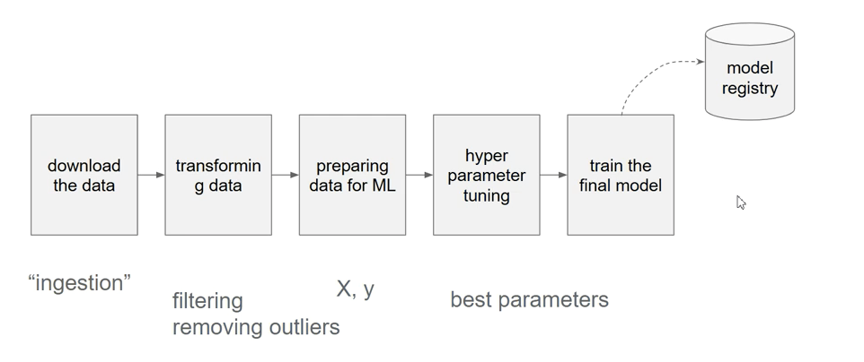

# ML Pipelines



-- 
📝 Notes on [how to use Mage](https://github.com/mleiwe/mlops-zoomcamp/blob/Ch3_ML_Notes/cohorts/2024/03-orchestration/ML_Notes.md) 

---

## 01 What Mage AI is (and isn’t)
- **Purpose:** an open‑source orchestrator for data & ML pipelines that blends notebook‑style interactivity with modular, file‑based code. Think *“Airflow‑like scheduling meets Jupyter‑like dev experience.”*

- **Core abstractions:** 

`project → pipeline → blocks (Python / SQL / R) → triggers & runs`. 

Each block is just a standalone script, so Git diffs are obvious and unit‑testing is easy.

 - **Why ML‑friendly:** built‑in real‑time & batch pipelines, streaming support, easy MLflow integration via add‑ons, and first‑class data catalog so you can version features and predictions.

## 02. Using Mage with Docker

1. Clone the following respository containing the complete code for this module:

    ```bash
    git clone https://github.com/mage-ai/mlops.git
    cd mlops
    ```

1. Launch Mage and the database service (PostgreSQL):

    ```bash
    ./scripts/start.sh
    ```

If don't have bash in your enviroment, modify the following command and run it:

    ```bash
    PROJECT_NAME=mlops \
        MAGE_CODE_PATH=/home/src \
        SMTP_EMAIL=$SMTP_EMAIL \
        SMTP_PASSWORD=$SMTP_PASSWORD \
        docker compose up
    ```

It is ok if you get this warning, you can ignore it:
     `The "PYTHONPATH" variable is not set. Defaulting to a blank string.`

1. The subproject that contains all the pipelines and code is named
   [`unit_3_observability`](./mlops/mlops/unit_3_observability/)

### 02.1 Run example pipeline

1. Open [`http://localhost:6789`](http://localhost:6789) in your browser.

1. In the top left corner of the screen next to the Mage logo and **`mlops`** project name,
   click the project selector dropdown and choose the **`unit_0_setup`** option.

1. Click on the pipeline named **`example_pipeline`**.
1. Click on the button labeled **`Run @once`**.

### 02.2 Your own first ML pipeline in five clicks
1. New pipeline → Start from scratch (or choose a template).

2. Add blocks:

- `loader` – read data (CSV, database, S3, etc.).

- `transformer` – feature engineering with pandas / SQL.

- `trainer` – train model; log to MLflow if desired.

- `evaluation` – compute metrics.

- `exporter` – save predictions or model artifact.

3. Drag edges between blocks to set dependencies.

4. Click ▶ inside each block to run interactively and inspect output—no waiting for the whole DAG.

5. Add a Trigger (cron, event, or API) so the pipeline runs automatically in production. 

- A Medium walk‑through that mirrors these steps: [Movie recommendation example](https://medium.com/%40yhulsurk/managing-data-pipelines-with-mage-ai-building-a-movie-recommendation-system-8b0e6d45fab9)

## 03 MLOps-Specific Tips

| **Need**                   | **Mage Feature / Add-On**                                                                                                                                       |
|---------------------------|------------------------------------------------------------------------------------------------------------------------------------------------------------------|
| **Experiment tracking**    | `mage-ai[mlflow]` extra; call `mlflow.log_params` / `mlflow.log_metrics` inside a block.                                                                         |
| **Model registry & promotion** | Use MLflow Model Registry or push artifacts to S3/GCS, then deploy via a separate inference pipeline triggered on “new model” events.                  |
| **Data & feature versioning** | Every block’s output is stored under `mage_data/`; configure remote storage (S3, GCS) in `metadata.yaml` for lineage across environments.                  |
| **CI/CD**                  | Because pipelines are just files, normal GitHub Actions / GitLab CI works. Many teams lint blocks, run unit tests, then spin up a Mage container for tests.   |
| **Scalability**            | Set concurrency limits per-pipeline or globally in `metadata.yaml`; for very large data sets, switch a block to Spark or DuckDB, or run Mage on Kubernetes.  |
