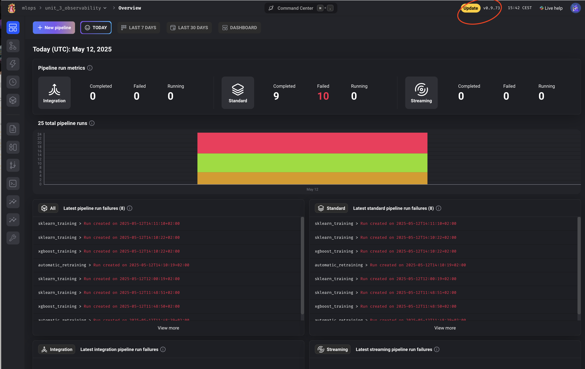
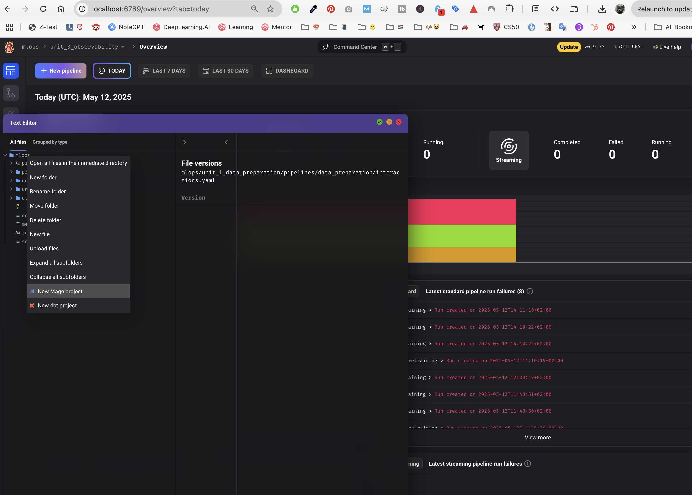
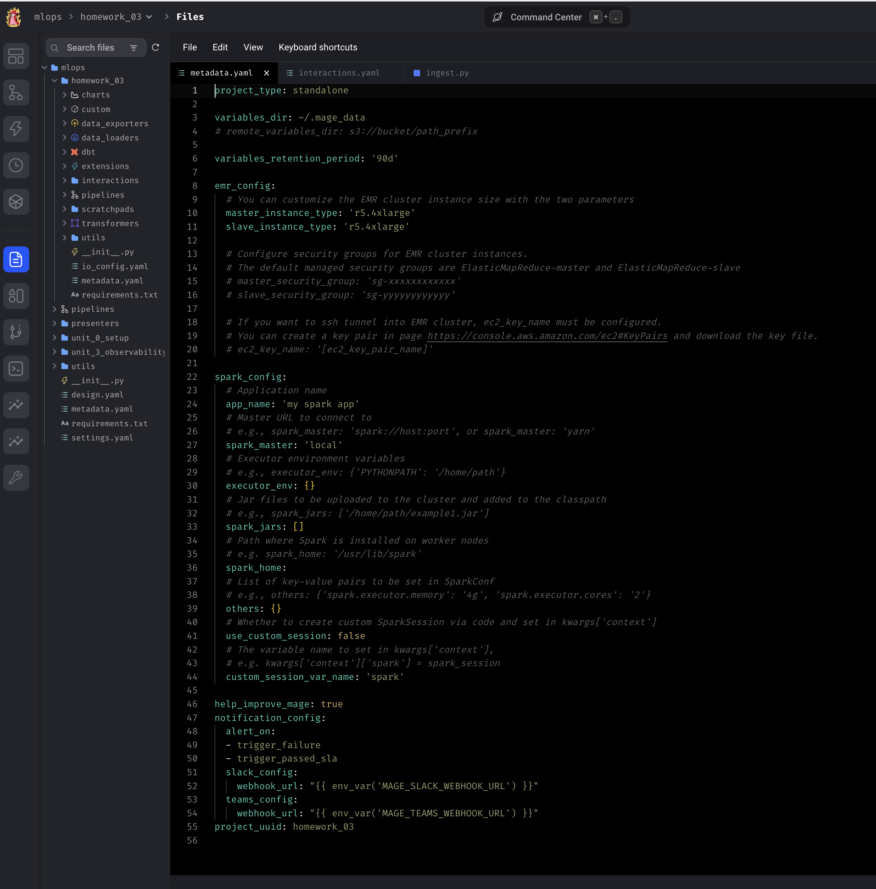
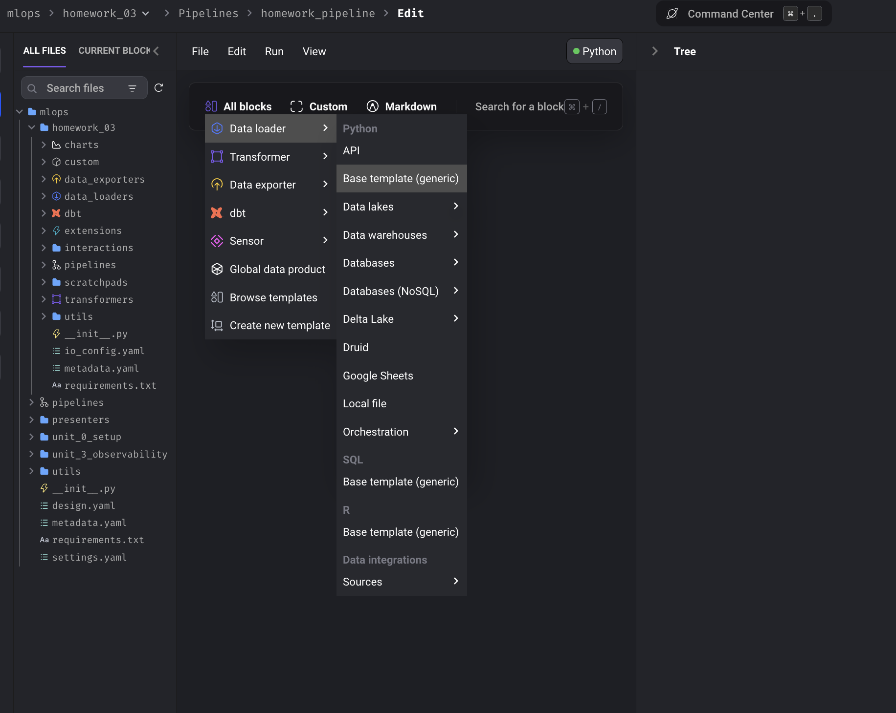
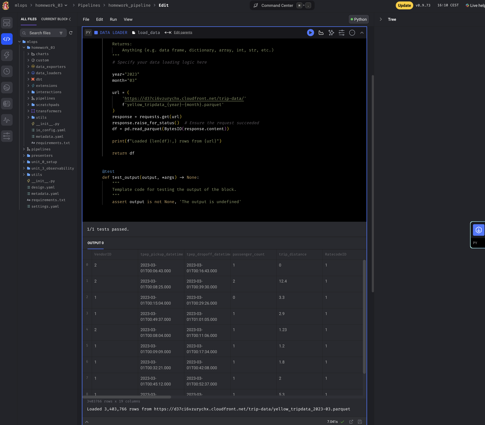
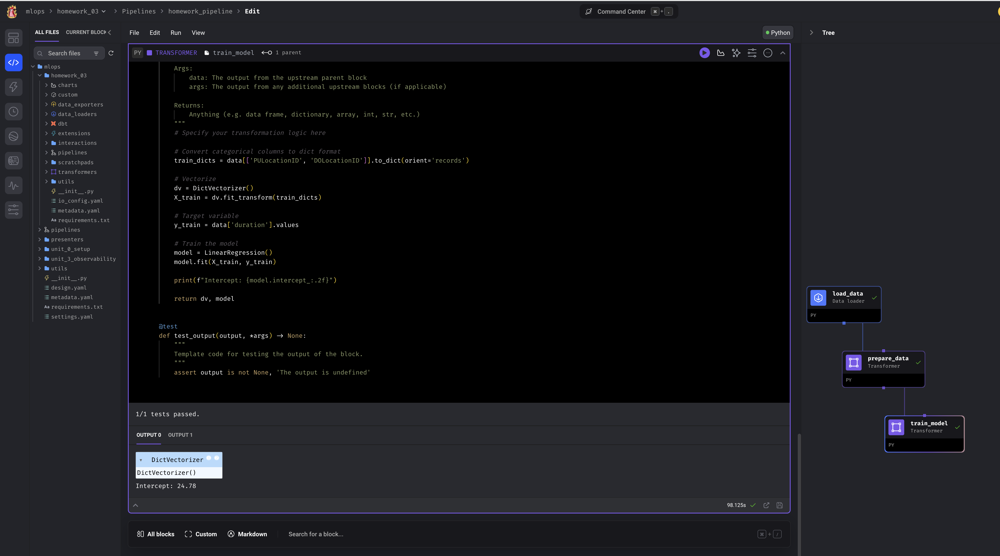

# Homework - Week 03 [DRAFT]

The goal of this homework is to create a simple training pipeline, use mlflow to track experiments and register best model, but use Mage for it.

We'll use [the same NYC taxi dataset](https://www1.nyc.gov/site/tlc/about/tlc-trip-record-data.page), the **Yellow** taxi data for March, 2023.


## Question 1. Run Mage

First, let's run Mage with Docker Compose. Follow the quick start guideline. 

What's the version of Mage we run? 
> v0.9.73


**👩🏽‍💻 Steps taken**

1. Go to [`mlops`](./../mlops/), and start Docker with `docker-compose up`.

2. Open the terminal at [http://localhost:6789/overview](http://localhost:6789/overview)

3. The version of Mage is printed at the top.




## Question 2. Creating a project

Now let's create a new project. We can call it "homework_03", for example.

How many lines are in the created `metadata.yaml` file? 

> - 55

**👩🏽‍💻 Steps taken**

1. To create a new project: open the terminal. Click with the right button into the main folder `mlops`. From there you will see the option to create a new project. 



2. Reload the page, and you can now change at the top to the new project.  On the left bar, click on `files` and you can check the number of lines of `metadata.yaml`.




## Question 3. Creating a pipeline

Let's create an ingestion code block.

In this block, we will read the March 2023 Yellow taxi trips data.

How many records did we load? 

> - 3,403,766

**👩🏽‍💻 Steps taken**

- Create a new block `data loader` inside the pipeline.



- Add the code as in [this file](./../mlops/mlops/homework_03/data_loaders/load_data.py) and run it.
You can now check the output:

The output:
`Loaded 3,403,766 rows from https://d37ci6vzurychx.cloudfront.net/trip-data/yellow_tripdata_2023-03.parquet`




## Question 4. Data preparation


Let's use the same logic for preparing the data we used previously. We will need to create a transformer code block and put this code there.

This is what we used (adjusted for yellow dataset):

```python
def read_dataframe(filename):
    df = pd.read_parquet(filename)

    df.tpep_dropoff_datetime = pd.to_datetime(df.tpep_dropoff_datetime)
    df.tpep_pickup_datetime = pd.to_datetime(df.tpep_pickup_datetime)

    df['duration'] = df.tpep_dropoff_datetime - df.tpep_pickup_datetime
    df.duration = df.duration.dt.total_seconds() / 60

    df = df[(df.duration >= 1) & (df.duration <= 60)]

    categorical = ['PULocationID', 'DOLocationID']
    df[categorical] = df[categorical].astype(str)
    
    return df
```

Let's adjust it and apply to the data we loaded in question 3. 

What's the size of the result?

> - 3,316,216 

**👩🏽‍💻 Steps taken**

1. Similar to the previous question, but now create a `transformer` block.
The code [is here](./../mlops/mlops/homework_03/pipelines/homework_pipeline/)

The output will be:
`Prepared data shape: (3316216, 20)`

## Question 5. Train a model

We will now train a linear regression model using the same code as in homework 1.

* Fit a dict vectorizer.
* Train a linear regression with default parameters.
* Use pick up and drop off locations separately, don't create a combination feature.

Let's now use it in the pipeline. We will need to create another transformation block, and return both the dict vectorizer and the model.

What's the intercept of the model? 

Hint: print the `intercept_` field in the code block

> - 24.77


**👩🏽‍💻 Steps taken**

As with the previous question, create a `transformer`.
The file is [here](./../mlops/mlops/homework_03/)



The output will be:
`Intercept: 24.78`

## Question 6. Register the model 

The model is trained, so let's save it with MLFlow.

If you run mage with docker-compose, stop it with Ctrl+C or 

```bash
docker-compose down
```

Let's create a dockerfile for mlflow, e.g. `mlflow.dockerfile`:

```dockerfile
FROM python:3.10-slim

RUN pip install mlflow==2.12.1

EXPOSE 5000

CMD [ \
    "mlflow", "server", \
    "--backend-store-uri", "sqlite:///home/mlflow_data/mlflow.db", \
    "--host", "0.0.0.0", \
    "--port", "5000" \
]
```

And add it to the docker-compose.yaml:

```yaml
  mlflow:
    build:
      context: .
      dockerfile: mlflow.dockerfile
    ports:
      - "5000:5000"
    volumes:
      - "${PWD}/mlflow_data:/home/mlflow_data/"
    networks:
      - app-network
```

Note that `app-network` is the same network as for mage and postgres containers.
If you use a different compose file, adjust it.

We should already have `mlflow==2.12.1` in requirements.txt in the mage project we created for the module. If you're starting from scratch, add it to your requirements.

Next, start the compose again and create a data exporter block.

In the block, we

* Log the model (linear regression)
* Save and log the artifact (dict vectorizer)

If you used the suggested docker-compose snippet, mlflow should be accessible at `http://mlflow:5000`.

Find the logged model, and find MLModel file. What's the size of the model? (`model_size_bytes` field):

* 14,534
* 9,534
* 4,534
* 1,534

> Note: typically we do last two steps in one code block.


## Submit the results

* Submit your results here: https://courses.datatalks.club/mlops-zoomcamp-2024/homework/hw3
* If your answer doesn't match options exactly, select the closest one.


