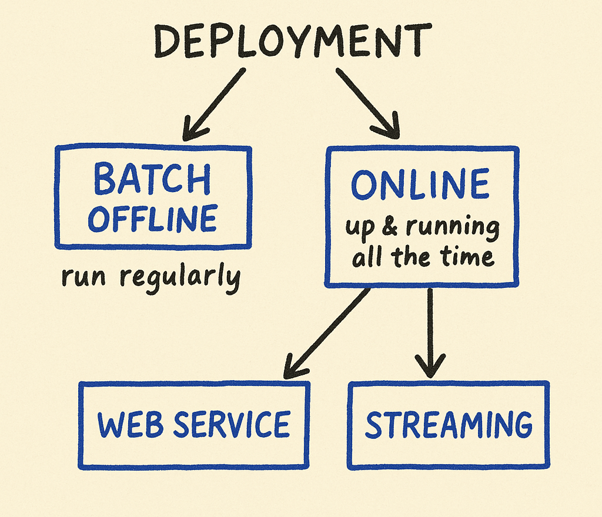

# Deployment

## Key Insights

Deployment strategies must be tailored to specific use cases for optimal performance. While batch processing works well for campaigns focused on historical data, web services are indispensable in low-latency scenarios, and streaming suits dynamic, real-time environments. The key lies in balancing effectiveness with resource management and user expectations.

- **📈 Batch Mode Deployment:** This mode is efficient for situations where immediate action is unneeded. By periodically processing historical data (e.g., user churn in marketing), organizations can devise strategies without real-time pressures. However, the challenge lies in the delayed insights and subsequent actions that may become obsolete over time, and it may require continuous monitoring of data relevance.

- **🌐 Web Service Deployment:** Web services are essential for applications requiring instantaneous responses. They allow for direct communication between client applications and deployed models, serving user requests in real-time. This setup can quickly become a bottleneck if the model is not optimized for performance because the service must handle concurrent requests without significant latency, impacting user experience.

- **🔄 Streaming Architecture:** This architecture facilitates a more flexible model that can respond to real-time events. In applications like ride-sharing or content moderation, various services can consume the same stream of data, leading to faster and more dynamic adaptations. However, managing complexity and ensuring data consistency can be a significant challenge as more consumers are added to the service.

    -**💡 Scalability of Streaming Models:** Streaming allows adding new services as consumers seamlessly without affecting existing operations. This flexibility can evolve a deployment from a simple model to a robust system capable of scaling with user demands, ideal for organizations aiming to innovate rapidly in their service offerings.

### Cost Implications of Deployment Choices
Different deployment methods come with varying cost structures. Batch jobs tend to be lower in operational costs due to less frequent execution, while maintaining web services can become expensive due to constant uptime requirements. Organizations need to analyze their budget in relation to their deployment strategy.

### 🔄 Feedback Loop Importance
Each deployment strategy can benefit from feedback systems. In streaming architectures, real-time feedback can be collected and used for immediate adjustments, enhancing the model over time. In contrast, batch processing might rely more heavily on back-testing results, which can lead to longer iteration cycles in terms of improvements.