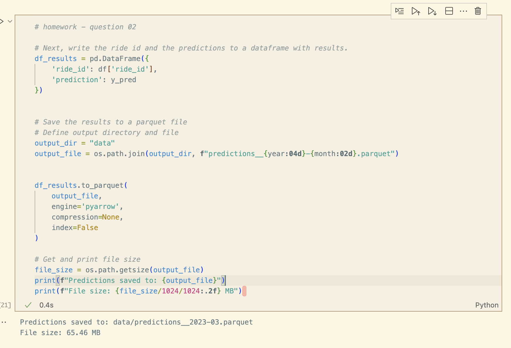
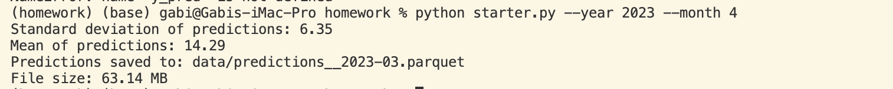
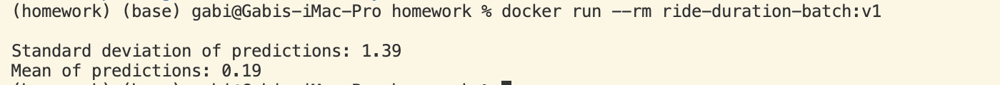

## Homework - Week 04

In this homework, we'll deploy the ride duration model in batch mode. Like in homework 1, we'll use the Yellow Taxi Trip Records dataset. 

## Q1. Notebook

We'll start with the same notebook we ended up with in homework 1.
We cleaned it a little bit and kept only the scoring part. You can find the initial notebook [here](homework/starter.ipynb).

Run this notebook for the March 2023 data.

What's the standard deviation of the predicted duration for this dataset?


> 6.24


**👩🏽‍💻 EXPLANATION**

1. Create a virtual environment with the specification of the [starter file](./starter.ipynb) so we can resuse the model.
This should be happen inside the [homework folder](./)

`pipenv install scikit-learn==1.5.0 --python 3.10`

2. Activate the environment
`pipenv shell`

3. Edit the [starter script](./starter.ipynb) and run it. You will need to adjust the date to March 2023 and print the standard devidation of the predictions.
Run the notebook and you will find the value.


## Q2. Preparing the output

Like in the course videos, we want to prepare the dataframe with the output.

First, let's create an artificial `ride_id` column:

```python
df['ride_id'] = f'{year:04d}/{month:02d}_' + df.index.astype('str')
```

Next, write the ride id and the predictions to a dataframe with results.

Save it as parquet:

```python
df_result.to_parquet(
    output_file,
    engine='pyarrow',
    compression=None,
    index=False
)
```

What's the size of the output file?

> 66M

__Note:__ Make sure you use the snippet above for saving the file. It should contain only these two columns. For this question, don't change the
dtypes of the columns and use `pyarrow`, not `fastparquet`. 

**👩🏽‍💻 EXPLANATION**
The [starter script](./starter.ipynb) was modified according to the requirements above.




## Q3. Creating the scoring script

Now let's turn the notebook into a script.
Which command you need to execute for that?

> jupyter nbconvert --to script starter.ipynb

**👩🏽‍💻 EXPLANATION**
- You need to have `nbconvert` installed to perform the conversion


## Q4. Virtual environment

Now let's put everything into a virtual environment. We'll use pipenv for that.

Install all the required libraries. Pay attention to the Scikit-Learn version: it should be the same as in the starter notebook.

After installing the libraries, pipenv creates two files: `Pipfile`
and `Pipfile.lock`. The `Pipfile.lock` file keeps the hashes of the
dependencies we use for the virtual env.

What's the first hash for the Scikit-Learn dependency?

> "sha256:057b991ac64b3e75c9c04b5f9395eaf19a6179244c089afdebaad98264bff37c"

**👩🏽‍💻 EXPLANATION**
- I already created the venv to be able to reuse the model.

## Q5. Parametrize the script

Let's now make the script configurable via CLI. We'll create two 
parameters: year and month.

Run the script for April 2023. 

What's the mean predicted duration? 


> 14.29


**👩🏽‍💻 EXPLANATION**

- Clean the [starter script](./starter.py) and add the modificatiosn necessary.

- Run the script:
`python starter.py --year 2023 --month 4`




## Q6. Docker container

Finally, we'll package the script in the docker container.
For that, you'll need to use a base image that we prepared.

This is what the content of this image is:

```dockerfile
FROM python:3.10.13-slim

WORKDIR /app
COPY [ "model2.bin", "model.bin" ]
```

Note: you don't need to run it. We have already done it.

It is pushed to [`agrigorev/zoomcamp-model:mlops-2024-3.10.13-slim`](https://hub.docker.com/layers/agrigorev/zoomcamp-model/mlops-2024-3.10.13-slim/images/sha256-f54535b73a8c3ef91967d5588de57d4e251b22addcbbfb6e71304a91c1c7027f?context=repo),
which you need to use as your base image.

That is, your Dockerfile should start with:

```dockerfile
FROM agrigorev/zoomcamp-model:mlops-2024-3.10.13-slim

# do stuff here
```

This image already has a pickle file with a dictionary vectorizer
and a model. You will need to use them.

Important: don't copy the model to the docker image. You will need
to use the pickle file already in the image. 

Now run the script with docker. What's the mean predicted duration
for May 2023? 

> 0.19


**👩🏽‍💻 EXPLANATION**

- Prepare the [dockerfile](./dockerfile)  according to the instructions above.

- Build the image:
`docker build -t ride-duration-batch:v1 .`

- Run the script inside Docker
`docker run --rm ride-duration-batch:v1`

**NOTE**: Because we put the parameters in `CMD`, the command above already executes
`python starter.py --year 2023 --month 5`. 
If you’d like to test another month just override the defaults:
`docker run --rm ride-duration-batch:v1 --year 2024 --month 7`.




--


## Bonus: upload the result to the cloud (Not graded)

Just printing the mean duration inside the docker image
doesn't seem very practical. Typically, after creating the output
file, we upload it to the cloud storage.

Modify your code to upload the parquet file to S3/GCS/etc.


## Bonus: Use Mage for batch inference

Here we didn't use any orchestration. In practice we usually do.

* Split the code into logical code blocks
* Use Mage to orchestrate the execution

## Publishing the image to dockerhub

This is how we published the image to Docker hub:

```bash
docker build -t mlops-zoomcamp-model:2024-3.10.13-slim .
docker tag mlops-zoomcamp-model:2024-3.10.13-slim agrigorev/zoomcamp-model:mlops-2024-3.10.13-slim

docker login --username USERNAME
docker push agrigorev/zoomcamp-model:mlops-2024-3.10.13-slim
```

This is just for your reference, you don't need to do it.
