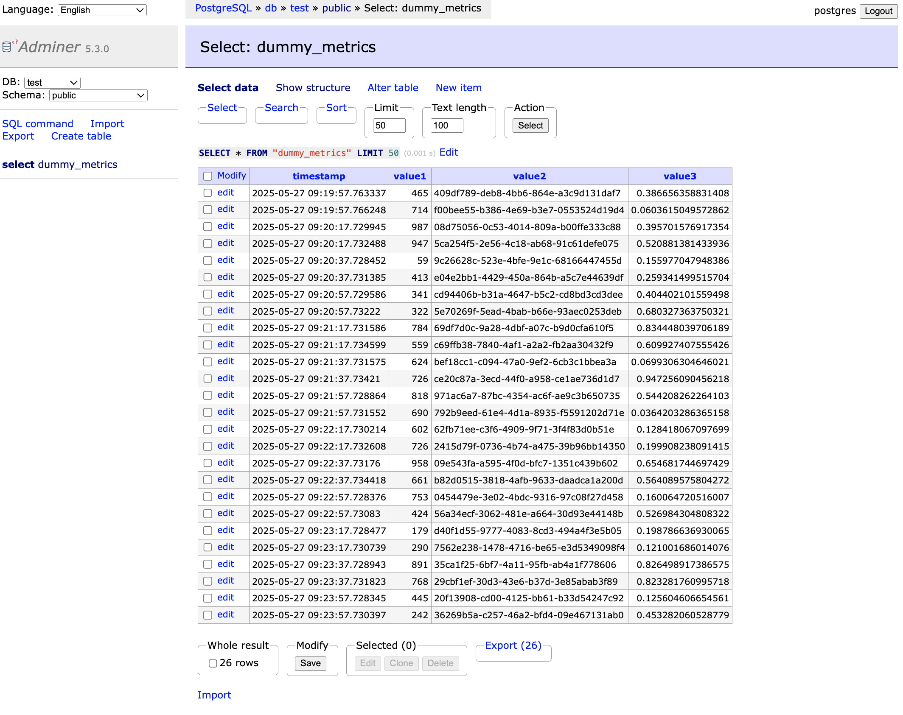
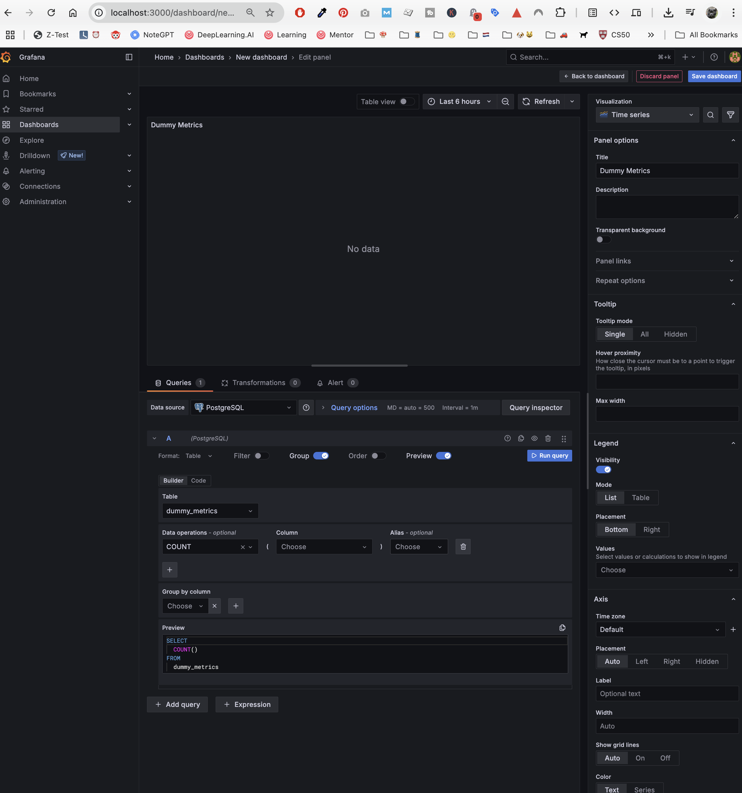
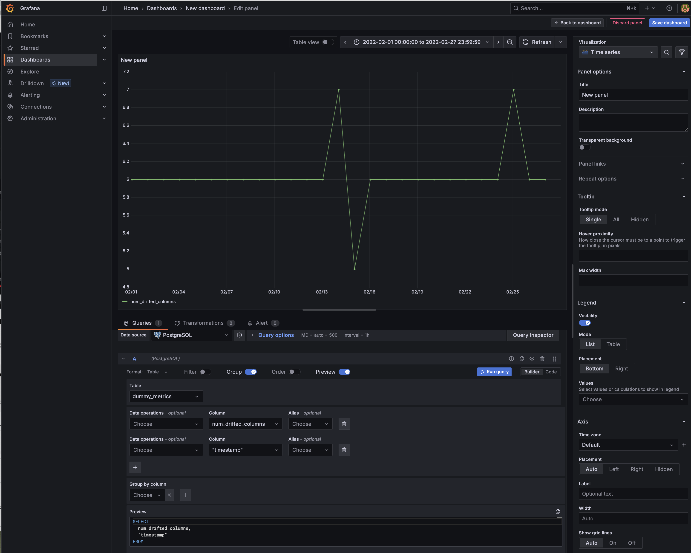
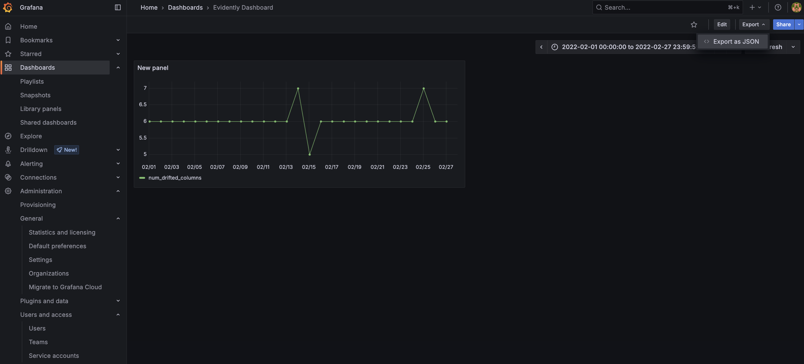

# MLOPS Model Monitoring

## 1.0 Introduction to Model Monitoring - Key Insights

- **🧩 Layered Approach to Monitoring ML Services:** Traditional service monitoring (uptime, latency) alone is insufficient for ML models. Adding layers that track model performance, data integrity, and drift offers a comprehensive view of the system’s health and reliability. This multi-faceted approach reduces blind spots and allows early detection of degradation.

- **📉 Data and Concept Drift as Early Warning Signals:** Since models interact with changing environments, shifts in data distribution (`data drift`) or target function behavior (`concept drift`) can predict performance drops before ground truth is available. Monitoring these drifts helps prevent prolonged periods of degraded model output, enhancing model lifecycle management.

- **⏳ Mitigating Ground Truth Latency with Proxy Metrics:** Ground truth labels often arrive with delays, making real-time error metrics impossible. Incorporating proxy signals, such as data quality or distribution checks, enables quicker identification of input anomalies and indirect signs of model issues, managing risks effectively.

- **⚖️ Fairness and Bias Monitoring for Sensitive Domains:** In areas with high ethical stakes (healthcare, finance), monitoring model bias and fairness is crucial. This prevents harmful disparate impacts and supports regulatory compliance. ***Segmenting metrics by user groups or categories enables granular insight into model behavior across diverse populations.***

- **🔄 Integration of Batch and Online Monitoring for Realistic ML Operations:** Pure real-time monitoring can be impractical for complex metrics like drift detection, which require distributional comparisons. Combining real-time checks with batch-windowed evaluations balances responsiveness and analytical depth, making monitoring feasible for streaming or API-based models.

- **🏢 Leveraging Existing Company Monitoring Infrastructures:** Many organizations already have production monitoring frameworks (e.g., Prometheus, Grafana, BI tools). Adapting these for ML model monitoring conserves resources and accelerates adoption. Starting with simpler batch analysis using BI dashboards can provide immediate value before introducing more sophisticated automation.

- **🛠️ Building a Generalizable and Modular Monitoring Pipeline:** The architecture outlined (logging, batch metrics computation, database storage, dashboard visualization) is decoupled and flexible. It supports diverse model types, varying deployment modes, and evolving monitoring needs. Using open-source tools like Evidently AI reduces development effort and ensures robust, reproducible monitoring.

## 02. Setting up the environement

📺 [Link to the video](https://www.youtube.com/watch?v=yixA3C1xSxc)

- Services used in Docker:
    - **Adminer:** Lightweight web app for browsing, querying, and managing your SQL databases (like PostgreSQL) through a simple point-and-click interface instead of the command line
    - **Grafana:** It lets you build real-time dashboards—charts, alerts, and panels—that visualize metrics and logs from your systems, so you can monitor how everything is running at a glance
    - **PostgreSQL** db used for storing metrics data

**STEPS**

0. Inside a folder [taxi_monitoring](./taxi_monitoring/)

1. Create virtual environment and activate it 
(eg. `python -m venv venv` && `source ./venv/bin/activate` or `conda create -n venv python=3.11` && `conda activate venv`)

2. Install [required packages](./taxi_monitoring/requirements.txt)
`pip install -r requirements.txt`

3. Create [docker-compose file](./taxi_monitoring/docker-compose.yml)

4. Create a folder [config](./taxi_monitoring/config/) and then the [grafana_datasources](./taxi_monitoring/config/grafana_datasources.yaml) file.

5. Save everything and try to run the container
`docker-compose up --build`

6. ✅ Verification Through UI Access Confirms System Integrity
    - Test Grafana: http://localhost:3000/
    - Test Adminer: http://localhost:8080/

3. Run baseline_model_nyc_taxi_data.ipynb for downloading datasets, training model and creating reference dataset

## 03. Prepare reference and model

📺 [Link to the video](https://www.youtube.com/watch?v=IjNrkqMYQeQ)

1. Create the folders `models` and `data` inside [taxi_monitoring](./taxi_monitoring/)

2. Run Jupyter, and create the file [baseline model](./taxi_monitoring/baseline_model_nyc_taxi_data.ipynb)

Ps: With the file above, you will also cover videos [04 Evidently Metrics Calculation](https://www.youtube.com/watch?v=kP3lzh_HfWYB) & [05 Evidently Monitoring Dashboard](https://www.youtube.com/watch?v=zjvYhDPzFlY)

## 04. Clarifying concepts Metrics & Monitoring

### What “drift” means in ML monitoring
- **Data drift (a.k.a. covariate shift):** The statistical properties of the input data change after the model is deployed.
    - Example: your training set had mostly weekday taxi rides, but production traffic is now weekend-heavy—trip-distance and pickup-time distributions move.

- **Concept drift**: The relationship between inputs and the target changes.
    - Example: a fare-estimation model was trained when fuel was cheap; fuel surcharges later increase fares for the same trip length.

Evidently focuses first on data drift: it compares each column’s current distribution with a reference distribution (usually a slice of your training data). If the distance between the two exceeds a threshold, that column is flagged as “drifted.

### “Drifted columns”
- A column (feature, prediction, or target) is “drifted” when its new distribution is statistically different from the reference.

- Evidently quantifies this with a test or distance metric—here, the normalized Wasserstein distance.You set or accept a threshold (e.g., 0.1). If the drift score ≥ threshold, the column is marked drifted; otherwise, “no drift detected.”

So, “drifted columns” are simply the features or outputs whose statistical behavior has shifted enough that Evidently (or another monitor) raises a flag, telling you the data flowing through—or produced by—your model no longer matches what it learned from.

## 05. Dummy monitoring

📺 [Link to the video](https://www.youtube.com/watch?v=s3G4PMsOMOA)

1. Prepare the file [dummy_metrics_calculation.py](./taxi_monitoring/dummy_metrics_calculation.py)

2. Run `docker-compose up``

3. Make sure you have your virtual environment activated and then run the script you prepared `python dummy_metrics_calculation.py`

4. According to the info you set in the docker-compose file, you can go to db Adminer (localhost:8080) and check if the dummy data is being fed correctly

5. Visualise the data in Grafana. You will need to create a new dashboard. From there you can create a query with the dummy values.

## 06. Data quality monitoring

📺 [Link to the video](https://www.youtube.com/watch?v=fytrmPbcLhI)

Now we will save the "real data" with [evidently_metrics_calculation.py](./taxi_monitoring/evidently_metrics_calculation.py). The data will be read day by day, with an interval of 10 seconds.

After a few runs, you can go back to Grafana and create more panels in the dashboard with the "real data". Don't forget to select the proper timeframe at the top (February 2022)

## 07. Saving Grafana Dashboard

1. We create a folder [dashboards](./taxi_monitoring/dashboards/)  and inside it an empty file data_drift.json

2. Go back to Grafana, save the dashboard. Now select the dashboard and click on the button "Export" on the top >> JSON. Copy the contents to your data_drift.json file.

